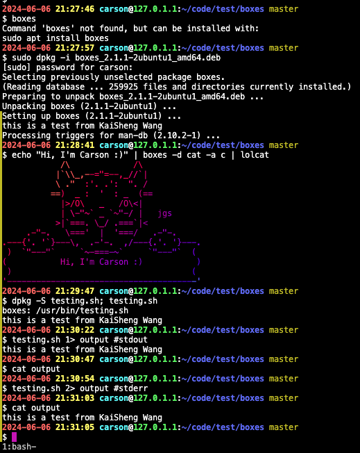
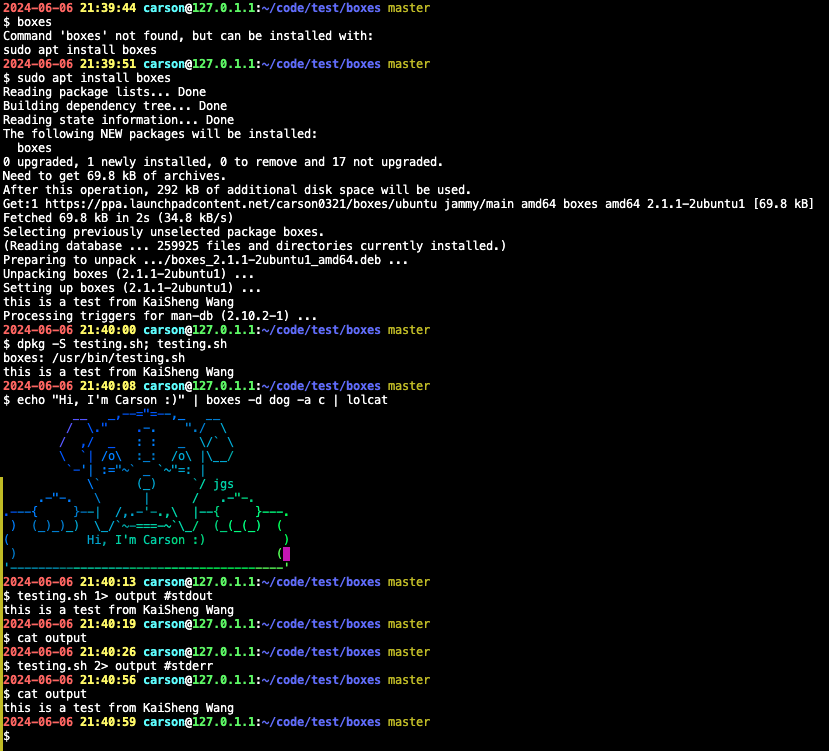
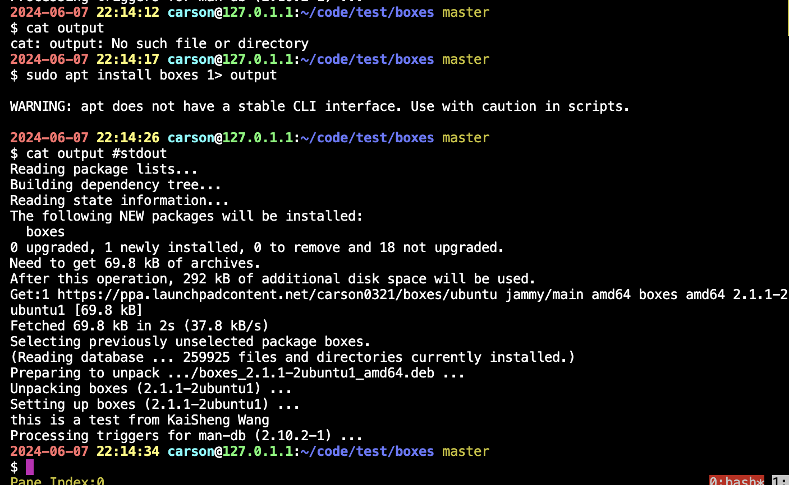
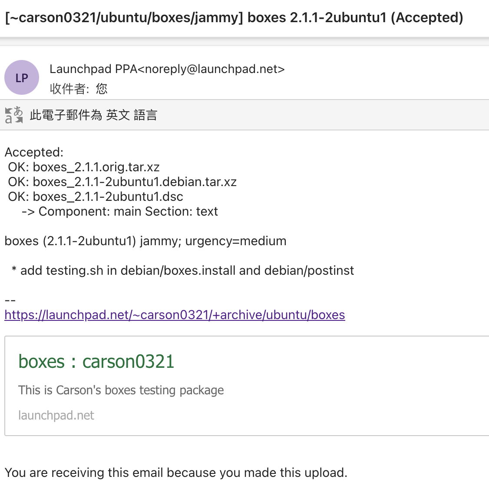
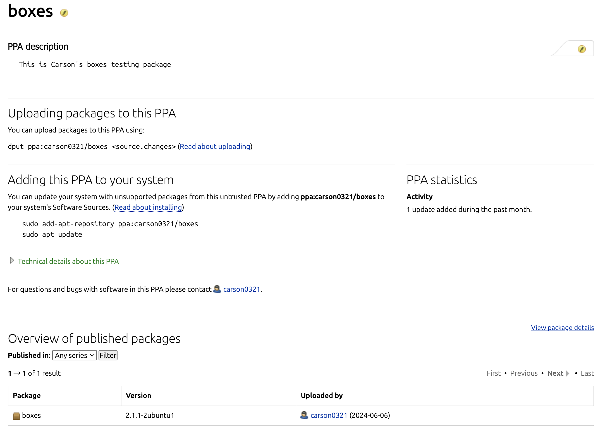
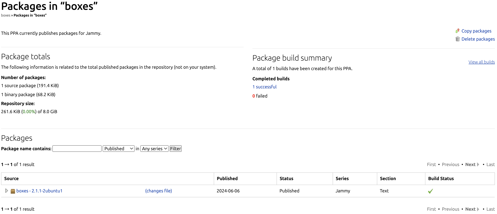

# Debian Packages testing

This guide will teach you how to install packages with modified source codes, using the [boxes](https://boxes.thomasjensen.com) library as an example.

## Environment

```bash
6.5.0-27-generic x86_64 GNU/Linux
Distributor ID: Ubuntu
Description:    Ubuntu 22.04.4 LTS
Release:        22.04
Codename:       jammy
```

## Summary

* `apt source boxes` or `pull-lp-source boxes jammy`
* Edit `debian/install` and `debian/postinst`
  * P.S. In the example, there exists a script named `debian/boxes.install`.
* `dch -i` and `dpkg-source --commit`
* `debuild -us -uc -S` and `debsign -k GPG_KEY *_source.changes`
* `dput ppa:<USER_ID>/<PPA_REPO> *_source.changes`

## Results







## Guide

First, we need to install some necessary library dependencies by running the following command with sudo privileges:

```bash
sudo apt install devscripts build-essentials fakeroot gnupg gpg dput dh-make lintian git make
# If there are any missing library dependencies, we may need to install them again.
# sudo apt install bison flex libunistring-dev xxd
```

These packages provide a variety of useful tools for building and packaging software libraries. Since this task is based on Debian package concepts, we need to select an existing Debian package to test the process. These packages can typically be found for download from the [Ubuntu archive](https://packaging.ubuntu.com/), [Debian archive](https://www.debian.org/distrib/packages), [GNU FTP](https://ftp.gnu.org/), and other sources.

We'll be using the [boxes](https://packages.ubuntu.com/jammy/boxes) package for this experiment. To begin, we can use the `apt source` command to obtain its source code. [APT](https://en.wikipedia.org/wiki/APT_(software)), or Advanced Package Tool, is a free-software user interface designed to handle software installation and removal on Debian and Debian-based Linux distributions. It's important to note that we may need to add the source URL to either `/etc/apt/sources.list` or `/etc/apt/sources.list.d/`, as it might not be found otherwise.

```bash
echo "deb-src http://cz.archive.ubuntu.com/ubuntu jammy main universe" | sudo tee -a /etc/apt/sources.list
# echo "deb-src http://cz.archive.ubuntu.com/ubuntu jammy main universe" | sudo tee -a /etc/apt/sources.list.d/boxes.list
sudo apt update
apt source boxes
```

The result is as shown below:

```bash
$ apt source boxes
Reading package lists... Done
NOTICE: 'boxes' packaging is maintained in the 'Git' version control system at:https://salsa.debian.org/carnil/boxes.git
Please use:git clone https://salsa.debian.org/carnil/boxes.git
to retrieve the latest (possibly unreleased) updates to the package.
Need to get 196 kB of source archives.
Get:1 http://cz.archive.ubuntu.com/ubuntu jammy/universe boxes 2.1.1-2 (dsc) [2,055 B]
Get:2 http://cz.archive.ubuntu.com/ubuntu jammy/universe boxes 2.1.1-2 (tar) [186 kB]Get:3 http://cz.archive.ubuntu.com/ubuntu jammy/universe boxes 2.1.1-2 (diff) [7,504 B]
Fetched 196 kB in 2s (116 kB/s)
dpkg-source: info: extracting boxes in boxes-2.1.1dpkg-source: info: unpacking boxes_2.1.1.orig.tar.xz
dpkg-source: info: unpacking boxes_2.1.1-2.debian.tar.xz
dpkg-source: info: using patch list from debian/patches/series
dpkg-source: info: applying default-GLOBALCONF-for-Debian.patch
dpkg-source: info: applying Fix-quoting-of-closing-comment-tags-in-config.patch

$ tree -L 2
.
├── boxes-2.1.1
│   ├── boxes-config│   ├── boxes-pkg.openwrt
│   ├── boxes.portable.nuspec
│   ├── boxes.vim│   ├── debian
│   ├── doc
│   ├── LICENSE
│   ├── Makefile
│   ├── README-0.gif
│   ├── README.md
│   ├── README.Win32.md│   ├── src
│   ├── test
│   └── tools├── boxes_2.1.1-2.debian.tar.xz
├── boxes_2.1.1-2.dsc
└── boxes_2.1.1.orig.tar.xz

6 directories, 12 files
```

We can explore alternative methods as well. For instance, obtaining the source code of a Debian package is straightforward using the [pull-lp-source](https://manpages.ubuntu.com/manpages/focal/man1/pull-lp-source.1.html) command. The result yields similar outcomes as described above.

```bash
# sudo apt install ubuntu-dev-tools
$ sudo pull-lp-source boxes jammy
Found boxes 2.1.1-2 in jammy
Downloading boxes_2.1.1-2.dsc from ports.ubuntu.com (0.002 MiB)
[=====================================================>]100%
Valid signature by 0x4644409808C171E05531DDEE054CB8F31343CF44
Downloading boxes_2.1.1.orig.tar.xz from ports.ubuntu.com (0.178 MiB)
[=====================================================>]100%
Downloading boxes_2.1.1-2.debian.tar.xz from ports.ubuntu.com (0.007 MiB)
[=====================================================>]100%

$ tree -L 2
.
├── boxes-2.1.1
│   ├── boxes-config
│   ├── boxes-pkg.openwrt
│   ├── boxes.portable.nuspec
│   ├── boxes.vim
│   ├── debian
│   ├── doc
│   ├── LICENSE
│   ├── Makefile
│   ├── README-0.gif
│   ├── README.md
│   ├── README.Win32.md
│   ├── src
│   ├── test
│   └── tools
├── boxes_2.1.1-2.debian.tar.xz
├── boxes_2.1.1-2.dsc
└── boxes_2.1.1.orig.tar.xz

6 directories, 12 files
```

Based on the outcome, several files are generated in the current directory. The `*.orig.tar.gz` file represents the upstream source, while the `*.debian.tar.xz` file encompasses custom changes made for Debian. Additionally, the `*.dsc` file serves as metadata.

Now, having obtained the source code of boxes with version 2.1.1, we proceed by navigating into the corresponding directory to fulfill the requirements. I've created a simple script (`my_script.sh`) to automate the generation of related files. By executing `bash my_script.sh`, the process is completed.

My script consists of several commands. The `cd` command is used to navigate into the target directory where various operations will be executed. It employs the `echo` command to create files, with the `-e` parameter enabling interpretation of backslash escapes. The `>` symbol indicates overwriting an existing file, while `>>` signifies appending to an existing file.

In addition to the `testing.sh` file, two crucial files named `debian/boxes.install` and `debian/postinst` are present. It's worth noting that there exists a `debian/boxes.install` file in the boxes package, otherwise, the standard practice is to use `debian/install`. The `debian/boxes.install` file dictates which files are installed and where they are placed within the package. Upon successful installation, the expected result is displayed using the `dpkg -S testing.sh; testing.sh` commands.

Furthermore, the `debian/postinst` file is executed after the package installation is completed. If a specific action needs to be performed before installing the package contents, a `debian/preinst` file can be created. As the execution of `testing.sh` is required during the installation of the Debian package, I employ the `debian/postinst` script to accomplish this task. Another crucial point is the need to output to stderr, hence the usage of `>&2`.

```bash
$ cat testing.sh
#!/bin/bash
set -e
echo "this is a test from KaiSheng Wang" >&2
exit 0

$ cat debian/boxes.install
out/boxes usr/bin
boxes-config etc/boxes
doc/boxes.el usr/share/emacs/site-lisp
testing.sh usr/bin

$ cat debian/postinst
#!/bin/bash
set -e
bash testing.sh
exit 0
```

Although the source code has been modified, it cannot be built into the package directly. We need to use `dch -i` to increase the Debian release number and add a new changelog entry before packaging it. This command will append a new comment line to the Debian changelog in the current source tree. It's essential to run this command from within that tree. If the text of the change is provided on the command line, `debchange` will operate in batch mode, simply adding the text, with necessary line breaks, to the appropriate place in `debian/changelog`.

After adding a new changelog entry, we must also run `dpkg-source --commit` to generate a patch corresponding to the local changes. If there are changes without a patch, the automated build process will fail when executing the `dpkg-buildpackage` command package further with the `debuild` command.

Using the `debuild` command with the `-us -uc` parameters ensures that the package is not signed with a GPG key during the automated build process. Upon completion of the program build, it generates `*.changes`, `*.build`, `*.buildinfo`, and `*.deb` files.

```bash
$ head -10 debian/changelogboxes (2.1.1-2ubuntu1) jammy; urgency=medium

  * add testing.sh in debian/boxes.install and debian/postinst

 -- carson <carson@carson-OptiPlex-7060>  Thu, 06 Jun 2024 21:00:01 +0800

boxes (2.1.1-2) unstable; urgency=medium

  * debian/copyright: Clarify upstream copyright stanza.
    - Update copyright information according to current upstream files.


$ dpkg-source --commit
dpkg-source: info: using patch list from debian/patches/series
dpkg-source: info: local changes detected, the modified files are:
 boxes-2.1.1/testing.sh
Enter the desired patch name: carson-test
dpkg-source: info: local changes have been recorded in a new patch: boxes-2.1.1/debian/patches/carson-test


$ cat debian/patches/carson-test
Description: <short summary of the patch>
 TODO: Put a short summary on the line above and replace this paragraph
 with a longer explanation of this change. Complete the meta-information
 with other relevant fields (see below for details). To make it easier, the
 information below has been extracted from the changelog. Adjust it or drop
 it.
 .
 boxes (2.1.1-2ubuntu1) jammy; urgency=medium
 .
   * add testing.sh in debian/boxes.install and debian/postinst
Author: carson <carson@carson-OptiPlex-7060>

---
The information above should follow the Patch Tagging Guidelines, please
checkout http://dep.debian.net/deps/dep3/ to learn about the format. Here
are templates for supplementary fields that you might want to add:

Origin: <vendor|upstream|other>, <url of original patch>
Bug: <url in upstream bugtracker>
Bug-Debian: https://bugs.debian.org/<bugnumber>
Bug-Ubuntu: https://launchpad.net/bugs/<bugnumber>
Forwarded: <no|not-needed|url proving that it has been forwarded>Reviewed-By: <name and email of someone who approved the patch>
Last-Update: 2024-06-06

--- /dev/null
+++ boxes-2.1.1/testing.sh
@@ -0,0 +1,4 @@
+#!/bin/bash
+set -e
+echo "this is a test from KaiSheng Wang" >&2
+exit 0


$ debuild -us -uc -S
 dpkg-buildpackage -us -uc -ui -S
dpkg-buildpackage: info: source package boxes
dpkg-buildpackage: info: source version 2.1.1-2ubuntu1
dpkg-buildpackage: info: source distribution jammy
dpkg-buildpackage: info: source changed by carson <carson@carson-OptiPlex-7060>
 dpkg-source --before-build .
 debian/rules clean
dh clean
   dh_auto_clean
        make -j12 clean
make[1]: Entering directory '/home/carson/code/test/boxes/boxes-2.1.1'
rm -f out/boxes.h tools/boxes.cfg tools/LICENSE.txt tools/boxes.exe tools/README*.md boxes.portable.*.nupkg
rm -f doc/boxes.1 doc/boxes.1.raw.html doc/boxes.1.html
make -C src clean
make[2]: Entering directory '/home/carson/code/test/boxes/boxes-2.1.1/src'
rm -rf ../out
rm -f core parser.h boxes.h lex.yy.h
make[2]: Leaving directory '/home/carson/code/test/boxes/boxes-2.1.1/src'
make[1]: Leaving directory '/home/carson/code/test/boxes/boxes-2.1.1'
   dh_clean
 dpkg-source -b .
dpkg-source: warning: Version number suggests Ubuntu changes, but Maintainer: does not have Ubuntu address
dpkg-source: warning: Version number suggests Ubuntu changes, but there is no XSBC-Original-Maintainer field
dpkg-source: info: using source format '3.0 (quilt)'
dpkg-source: info: building boxes using existing ./boxes_2.1.1.orig.tar.xz
dpkg-source: info: using patch list from debian/patches/series
dpkg-source: info: building boxes in boxes_2.1.1-2ubuntu1.debian.tar.xz
dpkg-source: info: building boxes in boxes_2.1.1-2ubuntu1.dsc
 dpkg-genbuildinfo --build=source -O./boxes_2.1.1-2ubuntu1_source.buildinfo
 dpkg-genchanges --build=source -O./boxes_2.1.1-2ubuntu1_source.changes
dpkg-genchanges: info: not including original source code in upload
 dpkg-source --after-build .
dpkg-buildpackage: info: source-only, diff-only upload (original source NOT included)
Use of uninitialized value $ENV{"DEBEMAIL"} in pattern match (m//) at /usr/bin/debuild line 1069.
Now running lintian boxes_2.1.1-2ubuntu1_source.changes ...
E: boxes changes: bogus-mail-host Changed-By carson@carson-OptiPlex-7060W: boxes source: maintainer-script-lacks-debhelper-token [debian/postinst]
Finished running lintian.
```

After that, we can install the modified package using sudo `dpkg -i XXX.deb`, which will yield the expected result. However, if we intend to install it through a [PPA](https://launchpad.net/ubuntu/+ppas), we'll need to execute additional commands. Assuming we have a PPA account, it's necessary to upload related files, including `*_source.changes`, to the PPA. These files can be generated using the `debuild -us -uc -S` command. Additionally, these files must be signed with the signatures by our GPG key in order to publish the modified source code to the PPA.

An important detail to note is that PPA can only utilize our master key to complete the package, or more precisely, we can only use the master key to sign the package for distribution. After uploading, PPA can correctly verify the validity of the package. This is because PPA does not accept subkeys when registering our GPG public key. To accomplish this, we need to execute the `debsign -k GPG_KEY *_source.changes` command.

Furthermore, generating a new PGP key and signing it on the PPA server is not a difficult task. In general, we can initiate the process by typing the `gpg --gen-key` command, which will guide us through generating a new PGP key. For more detailed information on this process, please refer to the [PPA website](https://help.launchpad.net/Packaging/PPA/InstallingSoftware).

```bash
$ debsign -k GPG_KEY ./boxes_2.1.1-2ubuntu1_source.changes
 signfile dsc ./boxes_2.1.1-2ubuntu1.dsc GPG_KEY

 fixup_buildinfo ./boxes_2.1.1-2ubuntu1.dsc ./boxes_2.1.1-2ubuntu1_source.buildinfo
 signfile buildinfo ./boxes_2.1.1-2ubuntu1_source.buildinfo GPG_KEY

 fixup_changes dsc ./boxes_2.1.1-2ubuntu1.dsc ./boxes_2.1.1-2ubuntu1_source.changes
 fixup_changes buildinfo ./boxes_2.1.1-2ubuntu1_source.buildinfo ./boxes_2.1.1-2ubuntu1_source.changes
 signfile changes ./boxes_2.1.1-2ubuntu1_source.changes GPG_KEY

Successfully signed dsc, buildinfo, changes files


$ dput -f ppa:carson0321/boxes ./boxes_2.1.1-2ubuntu1_source.changes
D: Splitting host argument out of  ppa:carson0321/boxes.
D: Setting host argument.
Checking signature on .changes
gpg: ./boxes_2.1.1-2ubuntu1_source.changes: Valid signature from XXXXXXX
Checking signature on .dsc
gpg: ./boxes_2.1.1-2ubuntu1.dsc: Valid signature from XXXXXXX
Uploading to ppa (via ftp to ppa.launchpad.net):
  Uploading boxes_2.1.1-2ubuntu1.dsc: done.
  Uploading boxes_2.1.1-2ubuntu1.debian.tar.xz: done.
  Uploading boxes_2.1.1-2ubuntu1_source.buildinfo: done.
  Uploading boxes_2.1.1-2ubuntu1_source.changes: done.
Successfully uploaded packages.
```

Once these steps are completed, we can utilize the tool `dput` provided by Debian. This tool enables us to push the distribution package to a public server. In essence, we upload our modified source code by executing the `dput ppa:<USER_ID>/<PPA_REPO> *_source.changes` command, after which PPA's server will send an email notification to us.

However, receiving an email with the accepted result does not imply immediate availability of our package for installation from the PPA. We need to allow some time for processing. After a while, its status will be set to "Published." Finally, we can install the modified package by executing the following commands:



```bash
sudo add-apt-repository ppa:<USER_ID>/<PPA_REPO>
sudo apt update
sudo apt install
```

These commands ensure that our modified package is successfully installed from the PPA repository.





## Referenses

* [Ubuntu packaging guide](https://packaging.ubuntu.com/html/)
  * [fixing-a-bug.html](https://packaging.ubuntu.com/html/fixing-a-bug.html)
* [Debian Developer Documentation](https://www.debian.org/doc/devel-manuals)
  * [Debian Policy](https://www.debian.org/doc/debian-policy/ch-maintainerscripts.html)
  * [Debian Maintainers Guide](https://www.debian.org/doc/manuals/debmake-doc/index.en.html)
  * [Developers Reference](https://www.debian.org/doc/manuals/developers-reference/pkgs.en.html)
  * [Packaging Tutorial](https://www.debian.org/doc/manuals/packaging-tutorial/packaging-tutorial.en.pdf)
* [PPA](https://help.launchpad.net/Packaging/PPA)
  * [BuildingASourcePackage](https://help.launchpad.net/Packaging/PPA/BuildingASourcePackage)
  * [ImportingYourPGPKey](https://help.launchpad.net/YourAccount/ImportingYourPGPKey)
  * [Uploading](https://help.launchpad.net/Packaging/PPA/Uploading)
  * [InstallingSoftware](https://help.launchpad.net/Packaging/PPA/InstallingSoftware)
* [Ubuntu GnuPrivacyGuardHowto](https://help.ubuntu.com/community/GnuPrivacyGuardHowto)
